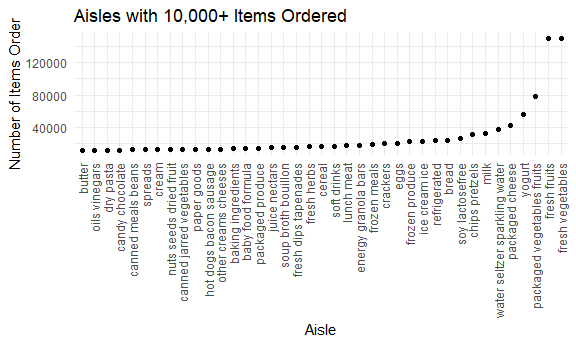

Homework 3
================
Jessica Flynn

``` r
library(tidyverse)
```

    ## -- Attaching packages --------------------------------------------- tidyverse 1.3.0 --

    ## v ggplot2 3.3.2     v purrr   0.3.4
    ## v tibble  3.0.3     v dplyr   1.0.2
    ## v tidyr   1.1.2     v stringr 1.4.0
    ## v readr   1.3.1     v forcats 0.5.0

    ## -- Conflicts ------------------------------------------------ tidyverse_conflicts() --
    ## x dplyr::filter() masks stats::filter()
    ## x dplyr::lag()    masks stats::lag()

``` r
library(p8105.datasets)

knitr::opts_chunk$set(
  fig.width = 6,
  fig.asp = .6,
  out.width = "90%"
)

theme_set(theme_minimal() + theme(legend.position = "bottom"))

options(
  ggplot2.continuous.colour = "viridis",
  ggplot2.continuous.fill = "viridis"
)

scale_colour_discrete = scale_colour_viridis_d
scale_fill_discrete = scale_fill_viridis_d
```

## Problem 1

``` r
data("instacart")
```

This data set contains 1384617 rows and 15 columns. Observations are at
the level of items in orders by users, , meaning there is 1 row for each
product ordered in each order. There are user / order variables
`user_id`, `order_id`, `order_dow` and `order_hour_of_day`. There are
also item variables – `product_name`, `aisle`, `department`, and numeric
codes for `product_id`, `aisle_id` and `department_id`. There are also
some variables regarding whether someone re-ordered an item
(`reordered`), what number order it is for a user (`order_number`) and
how many days since their prior order (`days_since_prior_order`).

How many aisles are there, and which aisles are the most items ordered
from?

There are a total for 134 aisles. The top 3 aisles that the most items
are ordered from are output in the table below.

``` r
instacart %>% 
  count(aisle) %>% 
  arrange(desc(n)) %>% 
  slice_head(n = 3) %>% 
  knitr::kable()
```

| aisle                      |      n |
| :------------------------- | -----: |
| fresh vegetables           | 150609 |
| fresh fruits               | 150473 |
| packaged vegetables fruits |  78493 |

Plot for aisles with more than 10000+ items ordered.

``` r
instacart %>% 
  count(aisle) %>% 
  filter(n > 10000) %>% 
  mutate( 
    aisle = factor(aisle), 
    aisle = fct_reorder(aisle, n)
    ) %>%
  ggplot(aes(x = aisle, y = n)) + 
  labs(
    title = "Aisles with 10,000+ Items Ordered",
    x = "Aisle",
    y = "Number of Items Order") + 
  theme(axis.text.x = element_text(angle = 90, vjust = 0.5, hjust = 1)) +
  geom_point()
```



Below is a table showing the three most popular items in each of the
aisles “baking ingredients”, “dog food care”, and “packaged vegetables
fruits”.

``` r
instacart %>% 
  filter(aisle %in% c("baking ingredients", "dog food care", "packaged vegetables fruits")) %>% 
  group_by(aisle) %>% 
  count(product_name) %>% 
  mutate(rank = min_rank(desc(n))) %>% 
  filter(rank < 4) %>% 
  arrange(aisle, rank) %>% 
  knitr::kable()
```

| aisle                      | product\_name                                 |    n | rank |
| :------------------------- | :-------------------------------------------- | ---: | ---: |
| baking ingredients         | Light Brown Sugar                             |  499 |    1 |
| baking ingredients         | Pure Baking Soda                              |  387 |    2 |
| baking ingredients         | Cane Sugar                                    |  336 |    3 |
| dog food care              | Snack Sticks Chicken & Rice Recipe Dog Treats |   30 |    1 |
| dog food care              | Organix Chicken & Brown Rice Recipe           |   28 |    2 |
| dog food care              | Small Dog Biscuits                            |   26 |    3 |
| packaged vegetables fruits | Organic Baby Spinach                          | 9784 |    1 |
| packaged vegetables fruits | Organic Raspberries                           | 5546 |    2 |
| packaged vegetables fruits | Organic Blueberries                           | 4966 |    3 |

Below is a table showing the mean hour of the day at which Pink Lady
Apples and Coffee Ice Cream are ordered on each day of the week

``` r
instacart %>% 
  filter(product_name %in% c("Pink Lady Apples", "Coffee Ice Cream")) %>% 
  group_by(product_name, order_dow) %>% 
  summarize(mean_hour =  mean(order_hour_of_day, na.rm = TRUE)) %>% 
  pivot_wider(
    names_from = order_dow, 
    values_from = mean_hour
  ) %>% 
  knitr::kable()
```

    ## `summarise()` regrouping output by 'product_name' (override with `.groups` argument)

| product\_name    |        0 |        1 |        2 |        3 |        4 |        5 |        6 |
| :--------------- | -------: | -------: | -------: | -------: | -------: | -------: | -------: |
| Coffee Ice Cream | 13.77419 | 14.31579 | 15.38095 | 15.31818 | 15.21739 | 12.26316 | 13.83333 |
| Pink Lady Apples | 13.44118 | 11.36000 | 11.70213 | 14.25000 | 11.55172 | 12.78431 | 11.93750 |

## Problem 2

``` r
accel_df = read_csv("./data/accel_data.csv") %>% 
  janitor::clean_names() %>%
  pivot_longer() %>% 
  mutate(weekend = )
```

table of 35 days, total activity in each day. do week \#1 and dow in
each to make more readable. use factors to re-order days. check class of
minutes

activity count y axis, minute on x axis, geom\_line, color for dow,

## Problem 3

``` r
library(p8105.datasets)
data("ny_noaa")
```

change tmin/tmax from 10ths of a degree to a degree

part 2 - group by and summarize + ggplot

part 3 - 2 different plot and merge them using patchwork
