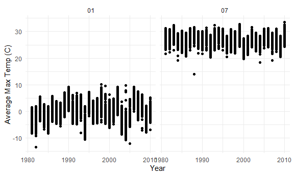

Homework 3
================
Jessica Flynn

``` r
library(tidyverse)
```

    ## -- Attaching packages ------------------------------------------- tidyverse 1.3.0 --

    ## v ggplot2 3.3.2     v purrr   0.3.4
    ## v tibble  3.0.3     v dplyr   1.0.2
    ## v tidyr   1.1.2     v stringr 1.4.0
    ## v readr   1.3.1     v forcats 0.5.0

    ## -- Conflicts ---------------------------------------------- tidyverse_conflicts() --
    ## x dplyr::filter() masks stats::filter()
    ## x dplyr::lag()    masks stats::lag()

``` r
library(p8105.datasets)

knitr::opts_chunk$set(
  fig.width = 6,
  fig.asp = .6,
  out.width = "90%"
)

theme_set(theme_minimal() + theme(legend.position = "bottom"))

options(
  ggplot2.continuous.colour = "viridis",
  ggplot2.continuous.fill = "viridis"
)

scale_colour_discrete = scale_colour_viridis_d
scale_fill_discrete = scale_fill_viridis_d
```

## Problem 1

``` r
data("instacart")
```

This data set contains 1384617 rows and 15 columns. Observations are at
the level of items in orders by users, , meaning there is 1 row for each
product ordered in each order. There are user / order variables
`user_id`, `order_id`, `order_dow` and `order_hour_of_day`. There are
also item variables – `product_name`, `aisle`, `department`, and numeric
codes for `product_id`, `aisle_id` and `department_id`. There are also
some variables regarding whether someone re-ordered an item
(`reordered`), what number order it is for a user (`order_number`) and
how many days since their prior order (`days_since_prior_order`).

How many aisles are there, and which aisles are the most items ordered
from?

There are a total for 134 aisles. The top 10 aisles that the most items
are ordered from are output in the table below.

``` r
instacart %>% 
  count(aisle) %>% 
  arrange(desc(n)) 
```

    ## # A tibble: 134 x 2
    ##    aisle                              n
    ##    <chr>                          <int>
    ##  1 fresh vegetables              150609
    ##  2 fresh fruits                  150473
    ##  3 packaged vegetables fruits     78493
    ##  4 yogurt                         55240
    ##  5 packaged cheese                41699
    ##  6 water seltzer sparkling water  36617
    ##  7 milk                           32644
    ##  8 chips pretzels                 31269
    ##  9 soy lactosefree                26240
    ## 10 bread                          23635
    ## # ... with 124 more rows

Plot for aisles with more than 10000+ items ordered.

``` r
instacart %>% 
  count(aisle) %>% 
  filter(n > 10000) %>% 
  mutate( 
    aisle = factor(aisle), 
    aisle = fct_reorder(aisle, n)
    ) %>%
  ggplot(aes(x = aisle, y = n)) + 
  labs(
    title = "Number of Items Ordered in Aisles with 10,000+ Items Ordered",
    x = "Aisle",
    y = "Number of Items Ordered") + 
  theme(axis.text.x = element_text(angle = 90, vjust = 0.5, hjust = 1)) +
  geom_point()
```


Below is a table showing the three most popular items in each of the
aisles “baking ingredients”, “dog food care”, and “packaged vegetables
fruits”.

``` r
instacart %>% 
  filter(aisle %in% c("baking ingredients", "dog food care", "packaged vegetables fruits")) %>% 
  group_by(aisle) %>% 
  count(product_name) %>% 
  mutate(rank = min_rank(desc(n))) %>% 
  filter(rank < 4) %>% 
  arrange(aisle, rank) %>% 
  knitr::kable()
```

| aisle                      | product\_name                                 |    n | rank |
| :------------------------- | :-------------------------------------------- | ---: | ---: |
| baking ingredients         | Light Brown Sugar                             |  499 |    1 |
| baking ingredients         | Pure Baking Soda                              |  387 |    2 |
| baking ingredients         | Cane Sugar                                    |  336 |    3 |
| dog food care              | Snack Sticks Chicken & Rice Recipe Dog Treats |   30 |    1 |
| dog food care              | Organix Chicken & Brown Rice Recipe           |   28 |    2 |
| dog food care              | Small Dog Biscuits                            |   26 |    3 |
| packaged vegetables fruits | Organic Baby Spinach                          | 9784 |    1 |
| packaged vegetables fruits | Organic Raspberries                           | 5546 |    2 |
| packaged vegetables fruits | Organic Blueberries                           | 4966 |    3 |

Below is a table showing the mean hour of the day at which Pink Lady
Apples and Coffee Ice Cream are ordered on each day of the week

``` r
instacart %>% 
  filter(product_name %in% c("Pink Lady Apples", "Coffee Ice Cream")) %>% 
  group_by(product_name, order_dow) %>% 
  summarize(mean_hour =  mean(order_hour_of_day, na.rm = TRUE)) %>% 
  pivot_wider(
    names_from = order_dow, 
    values_from = mean_hour) %>% 
  knitr::kable()
```

    ## `summarise()` regrouping output by 'product_name' (override with `.groups` argument)

| product\_name    |        0 |        1 |        2 |        3 |        4 |        5 |        6 |
| :--------------- | -------: | -------: | -------: | -------: | -------: | -------: | -------: |
| Coffee Ice Cream | 13.77419 | 14.31579 | 15.38095 | 15.31818 | 15.21739 | 12.26316 | 13.83333 |
| Pink Lady Apples | 13.44118 | 11.36000 | 11.70213 | 14.25000 | 11.55172 | 12.78431 | 11.93750 |

## Problem 2

``` r
accel_df = read_csv("./data/accel_data.csv") %>% 
  janitor::clean_names() %>%
  pivot_longer(
    cols =  starts_with("activity"),
    names_to = "minute", 
    names_prefix = "activity_",
    values_to = "activity") %>% 
  mutate(weekend = ifelse(day %in% c("Saturday", "Sunday"),1,0), 
         minute = as.numeric(minute), 
         day = factor(day, levels = c("Sunday", "Monday", "Tuesday", "Wednesday", "Thursday", "Friday", "Saturday")))
```

    ## Parsed with column specification:
    ## cols(
    ##   .default = col_double(),
    ##   day = col_character()
    ## )

    ## See spec(...) for full column specifications.

This dataset contains 5 weeks (35 days) worth of accelerometer data from
a 63 year old man with a BMI of 25 who was admitted to the Advanced
Cardiac Care Center of Columbia University Medical Center for congestive
heart failure (CHF). The accelerometer measures “activity counts” in
one-minute intevals.

After cleaning, tidying and wrangling the data, the results dataset has
50400 rows and 6 columns. Each row of the data set represents one minute
for each of the days the accelerometer was utilized. The variables in
the dataset include `week` taking values from 1 to 5 for each week of
use, as well as `day_id` ranging from 1 to 35 for each day of use. There
is also a variable `minute` ranging from 1 to 1440 for each minute in
the day.

Additionally, there is a variable `day` that represents the day of the
week the activity was recorded. This variables was converted to a factor
in re-ordered to the appropriate days of the week ordering (Sunday,
Monday, Tuesday, Wednesday, Thursday, Friday, Saturday). A variable
`weekend` was created that takes on the value 1 if the `day` is Saturday
or Sunday and 0 otherwise. Lastly, the variable `activity` contains a
measurement of the activity count for each minute of observation.

Below is a table of total activity by day for each of the 5 weeks

``` r
accel_day =
  accel_df %>% 
  group_by(day, week) %>% 
  summarize(total_activity = round(sum(activity, na.rm = TRUE)))
```

    ## `summarise()` regrouping output by 'day' (override with `.groups` argument)

``` r
# Make table more readable
accel_day %>% 
    pivot_wider(
    names_from = week, 
    values_from = total_activity) %>%
  knitr::kable()
```

| day       |      1 |      2 |      3 |      4 |      5 |
| :-------- | -----: | -----: | -----: | -----: | -----: |
| Sunday    | 631105 | 422018 | 467052 | 260617 | 138421 |
| Monday    |  78828 | 295431 | 685910 | 409450 | 389080 |
| Tuesday   | 307094 | 423245 | 381507 | 319568 | 367824 |
| Wednesday | 340115 | 440962 | 468869 | 434460 | 445366 |
| Thursday  | 355924 | 474048 | 371230 | 340291 | 549658 |
| Friday    | 480543 | 568839 | 467420 | 154049 | 620860 |
| Saturday  | 376254 | 607175 | 382928 |   1440 |   1440 |

Looking at this table, we notice that this person had very little
activity on Saturday during week 4 and week 5 (value of 1440). A general
trend that can be noticed is a decrease in activity towards the end of
the study, particularly on the weekends. The average total amount of
activity on a given day is 384543.5 and it ranged from 1440 to 685910.

ANY TREND I AM MISSING?

Make a single-panel plot that shows the 24-hour activity time courses
for each day and use color to indicate day of the week. Describe in
words any patterns or conclusions you can make based on this graph.
\#\#NEED HELP WITH THIS

``` r
accel_df %>% 
  group_by(day_id) %>%
  ggplot(aes(x = minute, y = activity, color = day)) + 
  geom_line()
```



## Problem 3

``` r
library(p8105.datasets)
data("ny_noaa")
```

change tmin/tmax from 10ths of a degree to a degree

part 2 - group by and summarize + ggplot

part 3 - 2 different plot and merge them using patchwork
