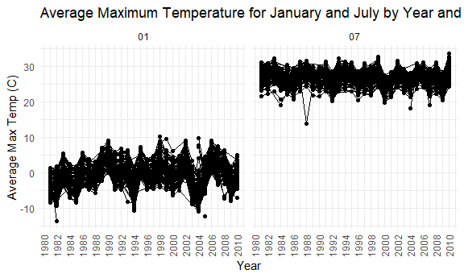
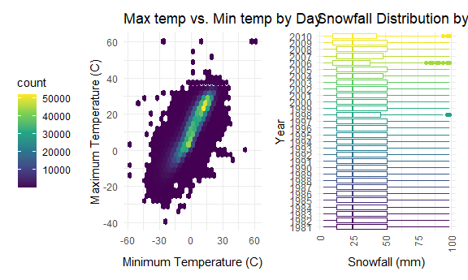

Homework 3
================
Jessica Flynn

``` r
library(tidyverse)
```

    ## -- Attaching packages --------------------------- tidyverse 1.3.0 --

    ## v ggplot2 3.3.2     v purrr   0.3.4
    ## v tibble  3.0.3     v dplyr   1.0.2
    ## v tidyr   1.1.2     v stringr 1.4.0
    ## v readr   1.3.1     v forcats 0.5.0

    ## -- Conflicts ------------------------------ tidyverse_conflicts() --
    ## x dplyr::filter() masks stats::filter()
    ## x dplyr::lag()    masks stats::lag()

``` r
library(patchwork)
library(p8105.datasets)

knitr::opts_chunk$set(
  fig.width = 6,
  fig.asp = .6,
  out.width = "90%")

theme_set(theme_minimal() + theme(legend.position = "bottom"))

options(
  ggplot2.continuous.colour = "viridis",
  ggplot2.continuous.fill = "viridis")

scale_colour_discrete = scale_colour_viridis_d
scale_fill_discrete = scale_fill_viridis_d
```

## Problem 1

``` r
data("instacart")
```

This data set contains 1384617 rows and 15 columns. Observations are at
the level of items in orders by users, , meaning there is 1 row for each
product ordered in each order. There are user / order variables
`user_id`, `order_id`, `order_dow` and `order_hour_of_day`. There are
also item variables – `product_name`, `aisle`, `department`, and numeric
codes for `product_id`, `aisle_id` and `department_id`. There are also
some variables regarding whether someone re-ordered an item
(`reordered`), what number order it is for a user (`order_number`) and
how many days since their prior order (`days_since_prior_order`).

How many aisles are there, and which aisles are the most items ordered
from?

There are a total for 134 aisles. The top 10 aisles that the most items
are ordered from are output in the table below.

``` r
instacart %>% 
  count(aisle) %>% 
  arrange(desc(n)) 
```

    ## # A tibble: 134 x 2
    ##    aisle                              n
    ##    <chr>                          <int>
    ##  1 fresh vegetables              150609
    ##  2 fresh fruits                  150473
    ##  3 packaged vegetables fruits     78493
    ##  4 yogurt                         55240
    ##  5 packaged cheese                41699
    ##  6 water seltzer sparkling water  36617
    ##  7 milk                           32644
    ##  8 chips pretzels                 31269
    ##  9 soy lactosefree                26240
    ## 10 bread                          23635
    ## # ... with 124 more rows

Plot for aisles with more than 10000+ items ordered.

``` r
instacart %>% 
  count(aisle) %>% 
  filter(n > 10000) %>% 
  mutate( 
    aisle = factor(aisle), 
    aisle = fct_reorder(aisle, n)) %>%
  ggplot(aes(x = aisle, y = n)) + 
  labs(
    title = "Number of Items Ordered in Aisles with 10,000+ Items Ordered",
    x = "Aisle",
    y = "Number of Items Ordered") + 
  theme(axis.text.x = element_text(angle = 90, vjust = 0.5, hjust = 1)) +
  geom_point()
```


Below is a table showing the three most popular items in each of the
aisles “baking ingredients”, “dog food care”, and “packaged vegetables
fruits”.

``` r
instacart %>% 
  filter(aisle %in% c("baking ingredients", "dog food care", "packaged vegetables fruits")) %>% 
  group_by(aisle) %>% 
  count(product_name) %>% 
  mutate(rank = min_rank(desc(n))) %>% 
  filter(rank < 4) %>% 
  arrange(aisle, rank) %>% 
  knitr::kable()
```

| aisle                      | product\_name                                 |    n | rank |
| :------------------------- | :-------------------------------------------- | ---: | ---: |
| baking ingredients         | Light Brown Sugar                             |  499 |    1 |
| baking ingredients         | Pure Baking Soda                              |  387 |    2 |
| baking ingredients         | Cane Sugar                                    |  336 |    3 |
| dog food care              | Snack Sticks Chicken & Rice Recipe Dog Treats |   30 |    1 |
| dog food care              | Organix Chicken & Brown Rice Recipe           |   28 |    2 |
| dog food care              | Small Dog Biscuits                            |   26 |    3 |
| packaged vegetables fruits | Organic Baby Spinach                          | 9784 |    1 |
| packaged vegetables fruits | Organic Raspberries                           | 5546 |    2 |
| packaged vegetables fruits | Organic Blueberries                           | 4966 |    3 |

Below is a table showing the mean hour of the day at which Pink Lady
Apples and Coffee Ice Cream are ordered on each day of the week

``` r
instacart %>% 
  filter(product_name %in% c("Pink Lady Apples", "Coffee Ice Cream")) %>% 
  group_by(product_name, order_dow) %>% 
  summarize(mean_hour =  mean(order_hour_of_day, na.rm = TRUE)) %>% 
  pivot_wider(
    names_from = order_dow, 
    values_from = mean_hour) %>% 
  knitr::kable()
```

    ## `summarise()` regrouping output by 'product_name' (override with `.groups` argument)

| product\_name    |        0 |        1 |        2 |        3 |        4 |        5 |        6 |
| :--------------- | -------: | -------: | -------: | -------: | -------: | -------: | -------: |
| Coffee Ice Cream | 13.77419 | 14.31579 | 15.38095 | 15.31818 | 15.21739 | 12.26316 | 13.83333 |
| Pink Lady Apples | 13.44118 | 11.36000 | 11.70213 | 14.25000 | 11.55172 | 12.78431 | 11.93750 |

## Problem 2

``` r
accel_df = read_csv("./data/accel_data.csv") %>% 
  janitor::clean_names() %>%
  pivot_longer(
    cols =  starts_with("activity"),
    names_to = "minute", 
    names_prefix = "activity_",
    values_to = "activity") %>% 
  mutate(weekend = case_when(day %in% c("Monday", "Tuesday", "Wednesday", "Thursday", "Friday") ~ "Weekday",
                             day %in% c("Saturday", "Sunday") ~ "Weekend"), 
         minute = as.numeric(minute), 
         day = factor(day, levels = c("Sunday", "Monday", "Tuesday", "Wednesday", "Thursday", "Friday", "Saturday")))
```

    ## Parsed with column specification:
    ## cols(
    ##   .default = col_double(),
    ##   day = col_character()
    ## )

    ## See spec(...) for full column specifications.

This dataset contains 5 weeks (35 days) worth of accelerometer data from
a 63 year old man with a BMI of 25 who was admitted to the Advanced
Cardiac Care Center of Columbia University Medical Center for congestive
heart failure (CHF). The accelerometer measures “activity counts” in
one-minute intervals.

After cleaning, tidying and wrangling the data, the results dataset has
50400 rows and 6 columns. Each row of the data set represents one minute
for each of the days the accelerometer was utilized. The variables in
the dataset include `week` taking values from 1 to 5 for each week of
use, as well as `day_id` ranging from 1 to 35 for each day of use. There
is also a variable `minute` ranging from 1 to 1440 for each minute in
the day.

Additionally, there is a variable `day` that represents the day of the
week the activity was recorded. This variable was converted to a factor
and re-ordered to the appropriate days of the week ordering (Sunday,
Monday, Tuesday, Wednesday, Thursday, Friday, Saturday). A variable
`weekend` was created to indicate whether a day was the weekend or a
weekday. Lastly, the variable `activity` contains a measurement of the
activity count for each minute of observation.

Below is a table of total activity by day for each of the 5 weeks

``` r
accel_df %>% 
  group_by(day, week) %>% 
  summarize(total_activity = round(sum(activity, na.rm = TRUE))) %>% 
  pivot_wider(
    names_from = day, 
    values_from = total_activity) %>%
  knitr::kable()
```

    ## `summarise()` regrouping output by 'day' (override with `.groups` argument)

| week | Sunday | Monday | Tuesday | Wednesday | Thursday | Friday | Saturday |
| ---: | -----: | -----: | ------: | --------: | -------: | -----: | -------: |
|    1 | 631105 |  78828 |  307094 |    340115 |   355924 | 480543 |   376254 |
|    2 | 422018 | 295431 |  423245 |    440962 |   474048 | 568839 |   607175 |
|    3 | 467052 | 685910 |  381507 |    468869 |   371230 | 467420 |   382928 |
|    4 | 260617 | 409450 |  319568 |    434460 |   340291 | 154049 |     1440 |
|    5 | 138421 | 389080 |  367824 |    445366 |   549658 | 620860 |     1440 |

Looking at this table, we notice that this person had very little
activity on Saturday during week 4 and week 5. A general trend that can
be noticed is a decrease in activity towards the end of the study,
particularly on the weekends. No other clear trends can be noticed from
this table.

The plot below provides information on the 24-hour activity time courses
for each day, using color to designate day of the week.

``` r
accel_df %>% 
  ggplot(aes(x = minute, y = activity, group = day_id, color = day)) +
  geom_line(alpha = .2) +
  geom_smooth(aes(group = day)) + 
  scale_x_continuous(
    breaks = c(seq(0,1440,120))) + 
  labs(title = "24 hour Activity Count by Day",
       x = "Minute", 
       y = "Activity Count")
```

    ## `geom_smooth()` using method = 'gam' and formula 'y ~ s(x, bs = "cs")'


Based on this graph, we can see that activity count is very minimal in
the beginning minutes of the day (around 12am to 4am), as the person is
probably asleep during this time. Activity increases until around minute
720 (12pm) and then plateaus until later in the evening. Around minute
1200 (8pm) there is an increase in activity that begins to decline again
until midnight. We can see spikes in activity between minutes 540 to 780
(9am to 1pm) on Sundays and between minutes 1200 to 1320 (8pm to 10pm)
on Fridays compared to all other days of the week.

## Problem 3

``` r
data("ny_noaa")
```

This dataset contains information from the `rnoaa` package in R, which
contains information from the National Oceanic and Atmospheric
Association (NOAA). This dataset is a subset of the NOAA data containing
information on New York state weather stations from 1981-01-01 through
2010-12-31

When we first read in the data without any alterations, there are
2595176 rows and 7 columns. There is a column `id` which contains each
weather station id, `date` which is the date of observation. Other
variables include `prcp` , `snow` and `snwd` which contain information
on precipitation, snowfall and snow depth, respectively. Lastly, `tmin`
and `tmax` provide information on the minimum and maximum temperatures
on a given day from each station.

There is a large extent of missingness in this dataset because not every
weather station collected information on all of the variables provided.
For example, `id` US1NYAB0001 has no information on `tmax` or `tmin`.
Missing data can be an issue here because some stations will be excluded
from certain analyses, which could lead to a biased sample of stations.
The percentages of missingness are described below:

  - 5.62% of `prcp` data is missing.
  - 14.69% of `snow` data is missing.
  - 22.8% of `snwd` data is missing.
  - 43.71% of `tmax` data is missing.
  - 43.71% of `tmin` data is missing

<!-- end list -->

``` r
ny_noaa = 
  ny_noaa %>%
  separate(date, 
           into = c("year", "month", "day"),
           sep = "-") %>%
  mutate(
    prcp = prcp / 10,
    tmin = as.numeric(tmin), 
    tmax = as.numeric(tmax),
    tmin = tmin / 10,
    tmax = tmax / 10)
```

After some data cleaning, we have changed `date` into 3 columns: `year`,
`month` and `day` using `separate()`. Additionally, the `prcp` was
changed from tenths of mm to mm and `tmin` and `tmax` were changed from
tenths of degrees celsius to degrees celsius.

``` r
ny_noaa %>% 
  count(snow) %>% 
  arrange(desc(n))
```

    ## # A tibble: 282 x 2
    ##     snow       n
    ##    <int>   <int>
    ##  1     0 2008508
    ##  2    NA  381221
    ##  3    25   31022
    ##  4    13   23095
    ##  5    51   18274
    ##  6    76   10173
    ##  7     8    9962
    ##  8     5    9748
    ##  9    38    9197
    ## 10     3    8790
    ## # ... with 272 more rows

The 10 most commonly observed values for snowfall are shown in the table
above. 0 is likely the most common because there are many days it does
not snow. `NA` is also likely common as certain weather stations may not
collect information on snowfall.

Below is a plot showing the average max temperature in January and in
July in each station across years (1981-2010). The left section “01”
represents January temperatures and the right section “07” represents
July temperatures.

``` r
ny_noaa %>% 
  filter(month %in% c("01","07")) %>% 
  group_by(year, month, id) %>% 
  summarize(avg_max_temp = mean(tmax, na.rm = TRUE)) %>% 
  mutate(year =  as.numeric(year)) %>%
  ggplot(aes(x = year, y = avg_max_temp, group = id)) +
  geom_point() +
  geom_path() +
  facet_grid(~month) +
  scale_x_continuous(breaks = c(seq(1980,2010,2))) +
  theme(axis.text.x = element_text(angle = 90, vjust = 0.5, hjust = 1)) +
  labs(title = "Average Maximum Temperature for January and July by Year and Station",
       x = "Year", 
       y = "Average Max Temp (C)") 
```

    ## `summarise()` regrouping output by 'year', 'month' (override with `.groups` argument)

    ## Warning: Removed 5970 rows containing missing values (geom_point).

    ## Warning: Removed 5931 row(s) containing missing values (geom_path).



Looking at this plot, we can see that the average max temperature is
much high in July than in January, as expected. In regards to observable
structure, we can see that for January, that average maximum temperature
appears to have a general trend of rising over the years. This could
possibly be attributed to global warming. The average maximum
temperature seems stable across the years in July. There are some
outliers on both the January and July plots. For one station in the 1982
and one station in 2005 in January, the average maximum temperature was
particularly low compared to the rest of the stations. Additionally, in
2004 several stations had higher average temperatures in January
compared to the rest of the stations. In July, in 1988 one station have
an average maximum temperature far below the rest.

``` r
tmax_tmin = 
  ny_noaa %>% 
  ggplot(aes(x = tmin, y = tmax)) + 
  geom_hex() + 
  labs(title = "Max temp vs. Min temp by Day",
       x = "Minimum Temperature (C)", 
       y = "Maximum Temperature (C)") + 
  theme(legend.position = "left")

snow_dist = 
  ny_noaa %>% 
  filter(snow > 0, snow < 100) %>% 
  ggplot(aes(x = year, y = snow, color =  year)) + 
  geom_boxplot() + 
  theme(axis.text.x = element_text(angle = 90, vjust = 0.5, hjust = 1)) + 
  labs(title = "Snowfall Distribution by Year",
       x = "Year", 
       y = "Snowfall (mm)") +
  theme(legend.position = "none") + 
  coord_flip()


(tmax_tmin + snow_dist) 
```

    ## Warning: Removed 1136276 rows containing non-finite values (stat_binhex).



The first panel of the plot shows a positive correlation between max and
min temperatures on any given day. In context, this means on days when
stations reported higher minimum temperatures they reported higher
maximum temperatures as well. This is reasonable as hotter days are
likely to have higher minimum temperatures than cooler days.

The second panel of the plot shows the snowfall distribution by year. We
can see that there were comparable median and IQR values of snow
reported across years. We can also see that the years 1998, 2006 and
2010 had some extremely large snowstorms
